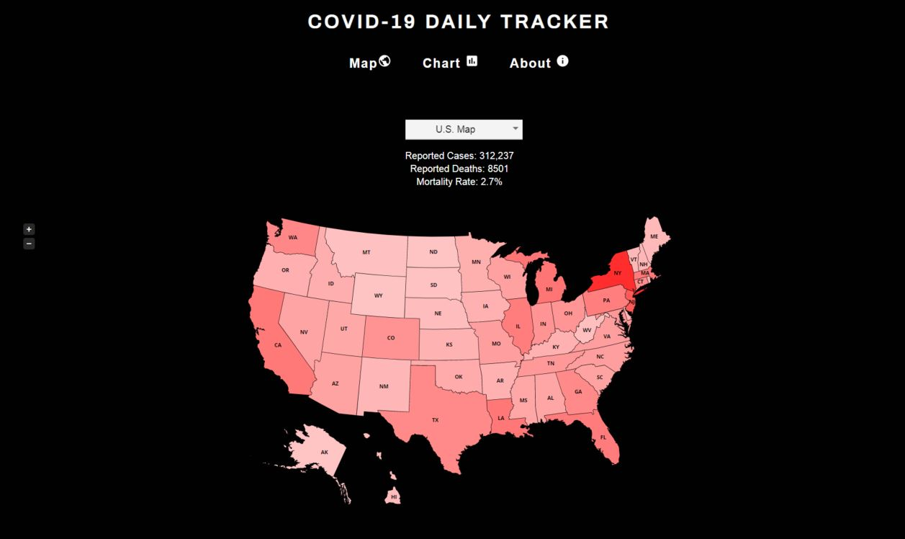

# Coronavirus Daily Tracker

Website built with React to track daily COVID-19 reported cases and deaths by country and U.S state via heat maps
and time charts

View the website [here](https://www.coronavirusdailytracker.info/)

**Most data on coronavirus has one or more of the following characteristics**:
- Lacks reputable, verifiable data sources
- Has data visualizations that are static images - you can't interact with them!
- User experience is poor, clunky or overloaded

**This website was made with a few specific goals**:
- Rely on a reputable data source, one that users can easily verify for themselves
- Have simple but sleek data visualizations
- Present a minimal, focused user experience

**Data sourced from [open-covid-19](https://github.com/open-covid-19/data)**

## Screenshots

### World Map

### U.S. Map

### Country Statistics

### Country Chart

### About Page

